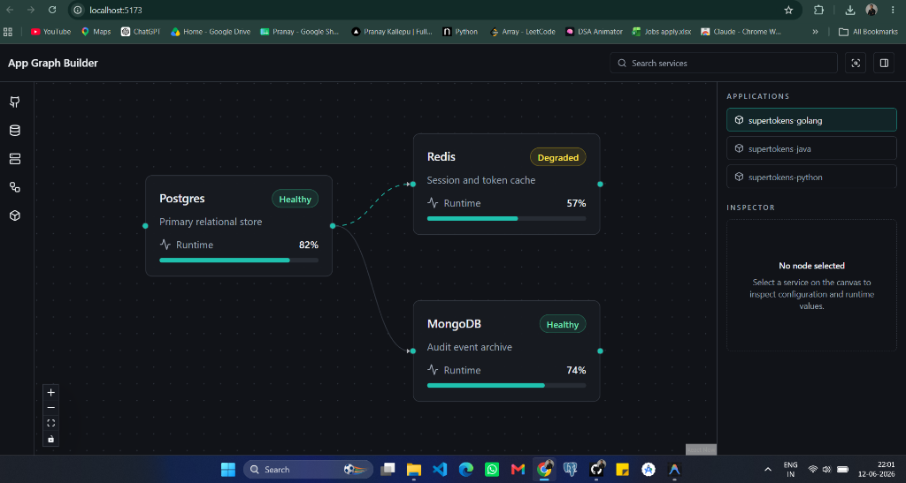
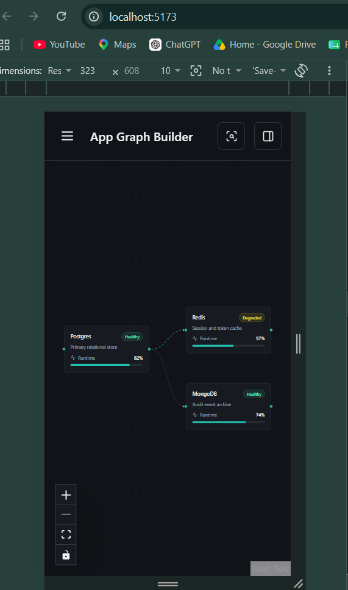

# App Graph Builder

A production-quality React application for visualizing and managing service dependency graphs. The project simulates a cloud infrastructure dashboard using ReactFlow, TanStack Query, Zustand, and Mock Service Worker (MSW).

## Screenshots

### Desktop View


### Mobile View


---

## Overview

App Graph Builder allows users to:

* Visualize application service dependencies
* Explore node relationships through an interactive graph
* Inspect service configurations and runtime information
* Switch between multiple application environments
* Simulate API interactions using mocked backend services
* Manage graph state with performant ReactFlow integration

The application follows modern frontend architecture principles by separating:

* Server State → TanStack Query
* UI State → Zustand
* Graph State → ReactFlow
* Mock Backend → MSW

---

## Tech Stack

| Category      | Technology                |
| ------------- | ------------------------- |
| Framework     | React 19                  |
| Build Tool    | Vite                      |
| Language      | TypeScript (Strict Mode)  |
| Graph Engine  | ReactFlow (@xyflow/react) |
| UI Components | shadcn/ui                 |
| Styling       | Tailwind CSS              |
| Server State  | TanStack Query            |
| UI State      | Zustand                   |
| Mock APIs     | Mock Service Worker (MSW) |
| Icons         | Lucide React              |
| Linting       | ESLint                    |

---

## Features

### Layout System

* Responsive dashboard layout
* Top navigation bar
* Left navigation rail
* Central graph canvas
* Right-side inspector panel
* Mobile slide-over drawer

### ReactFlow Integration

* Interactive node graph
* Drag and drop nodes
* Node selection
* Zoom and pan controls
* Dotted background grid
* Delete selected node
* Fit View functionality

### Service Inspector

* Status indicators
* Runtime metrics
* Configuration panel
* Editable node metadata
* Real-time updates

### Data Layer

* Cached API requests
* Loading states
* Error handling
* Graph refetch on app switch
* Simulated network latency

---

## Project Structure

```text
src/
│
├── app/
│   └── providers/
│
├── components/
│   ├── layout/
│   ├── canvas/
│   └── inspector/
│
├── hooks/
│
├── mocks/
│
├── services/
│
├── store/
│
├── pages/
│
├── types/
│
├── App.tsx
└── main.tsx
```

---

## Application Architecture

### High Level Architecture

```text
┌──────────────────────────────────────┐
│              React App               │
└──────────────────────────────────────┘
                 │
                 ▼
┌──────────────────────────────────────┐
│             Dashboard                │
└──────────────────────────────────────┘
       │              │
       ▼              ▼
 TanStack Query    Zustand
(Server State)    (UI State)
       │
       ▼
 ReactFlow Canvas
       │
       ▼
 Node Inspector
```

---

## State Management Strategy

### Zustand

Used for transient UI state:

```ts
selectedAppId
selectedNodeId
mobilePanelOpen
activeInspectorTab
fitViewTrigger
```

### TanStack Query

Used for:

```ts
GET /api/apps
GET /api/apps/:appId/graph
```

Responsibilities:

* Data fetching
* Request caching
* Loading states
* Error states
* Automatic refetching

### ReactFlow State

Managed locally using:

```ts
useNodesState()
useEdgesState()
```

Reasons:

* Frequent updates
* Drag operations
* Better rendering performance

---

## Data Flow

### Application Selection

```text
User
 │
 ▼
Select App
 │
 ▼
Zustand Store
 │
 ▼
TanStack Query
 │
 ▼
Mock API (MSW)
 │
 ▼
Graph Data
 │
 ▼
ReactFlow Canvas
```

### Node Selection

```text
User Clicks Node
        │
        ▼
ReactFlow
        │
        ▼
selectedNodeId
        │
        ▼
Node Inspector
```

### Node Updates

```text
Inspector
    │
    ▼
Update Node Data
    │
    ▼
ReactFlow State
    │
    ▼
Canvas Re-render
```

---

## Mock APIs

### Get Applications

```http
GET /api/apps
```

Response:

```json
[
  {
    "id": "1",
    "name": "supertokens-golang"
  }
]
```

### Get Graph

```http
GET /api/apps/:appId/graph
```

Response:

```json
{
  "nodes": [],
  "edges": []
}
```

Artificial latency:

```text
800ms - 1200ms
```

Used for testing:

* Skeleton screens
* Loading indicators
* Error handling

---

## Available Scripts

Install dependencies:

```bash
npm install
```

Development server:

```bash
npm run dev
```

Lint project:

```bash
npm run lint
```

Type checking:

```bash
npm run typecheck
```

Production build:

```bash
npm run build
```

Preview build:

```bash
npm run preview
```

---

## Development Workflow

### Start Development

```bash
git clone <repository-url>

cd app-graph-builder

npm install

npm run dev
```

### Verify Quality

```bash
npm run lint

npm run typecheck

npm run build
```

All commands should complete successfully before submission.

---

## Design Decisions

### Why ReactFlow?

Provides:

* Built-in graph interactions
* Node dragging
* Zoom and pan support
* Custom node rendering
* High performance

### Why Zustand?

* Minimal boilerplate
* Excellent TypeScript support
* Perfect for lightweight UI state

### Why TanStack Query?

* Built-in caching
* Request deduplication
* Loading and error handling
* Refetch management

### Why MSW?

* Simulates real backend APIs
* No backend dependency
* Easy testing and development

---

## Known Limitations

* Graph changes are not persisted
* Search input is UI-only
* No authentication layer
* No backend database
* No real-time synchronization
* Inspector updates are local to current session

---

## Future Enhancements

* Add Node functionality
* Graph persistence
* Multiple node types
* Search filtering
* Undo / Redo support
* Keyboard shortcuts
* Dark/Light theme switcher
* Real backend integration
* Collaborative editing

---

## Acceptance Criteria Covered

* Responsive layout
* ReactFlow integration
* Node dragging
* Node selection
* Node deletion
* Zoom and pan
* Dotted background
* Zustand state management
* TanStack Query caching
* MSW API mocking
* Loading states
* Error states
* TypeScript strict mode
* ESLint configuration
* Mobile drawer support

---

## Author

Pranay Kallepu

B.Tech AIML | Full Stack Developer | React & MERN Stack Enthusiast
